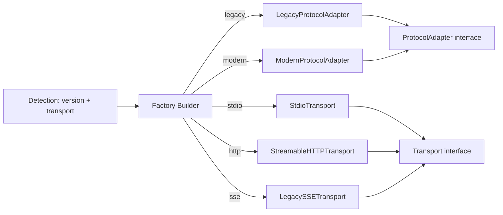
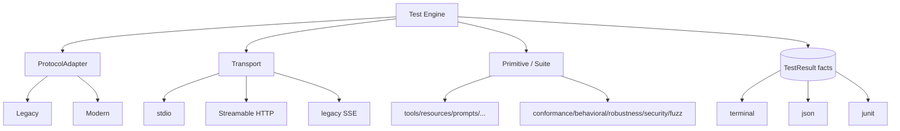

# `testmymcp` — Project Blueprint

> A Node CLI (npx-runnable) that acts as a **protocol conformance + interoperability + robustness tester** for MCP servers. It must cover both protocol eras — Legacy (`2024-11-05`, `2025-03-26`, `2025-06-18`, `2025-11-25`) and Modern (`2026-07-28`) — across all transports and primitives, including fuzzing and agent-safety scanning.

This document is the locked reference for the project architecture. It is intentionally at the blueprint/architecture level — no implementation code.

---

## Decisions locked

1. **Legacy-first**, built on **interfaces** + a **factory builder** so new protocol versions/transports plug in without touching existing code.
2. **Hybrid client engine** — official `@modelcontextprotocol/sdk` for the happy path, hand-rolled low-level sender for fuzzing/conformance.
3. **TypeScript**, with a **verify-first** approach: scaffold minimal code → confirm lint + build work → then implement features.
4. **2026-07-28 spec**: treat this doc as the plan; the real spec details will be fetched at Phase 3 (Modern). No action now.
5. **Security scan** stays **Phase 5** — not an immediate priority.

---

## 1. Core design principles

- **Four independent dimensions**: protocol version × lifecycle × transport × primitive/suite. Never write `if (stdio && oldVersion && tools)`.
- **Interface + factory**: every swappable component is behind an interface; a factory builder instantiates the concrete implementation from detected version/transport. This is the mechanism that keeps the four dimensions orthogonal.
- **Tests emit `TestResult` facts**; renderers consume them.
- **Four failure layers**: Transport / JSON-RPC / MCP-protocol / Application-tool. A tool returning `isError:true` over a valid HTTP 200 is an *application* failure, not an MCP failure.
- **Tracing + redaction by default**: every byte in/out is traced; secrets are `REDACTED` unless `--show-secrets`.

---

## 2. Interface & factory surface

The contracts that make "implement new versions easily" true:



Key interfaces (contracts only, no impl yet):

- `ProtocolAdapter` — lifecycle (`connect`, `discover`/`initialize`, `shutdown`), capability negotiation, version handling.
- `Transport` — `send`/`receive`, framing, connect/close, stderr capture (stdio).
- `PrimitiveSuite` — tools / resources / prompts / completion (each version-aware).
- `Extension` — registry entry (tasks, apps, …); unknown → reported, not fatal.
- `TestSuite` — emits `TestResult[]`.
- `Reporter` — terminal / json / junit.

Factories: `ProtocolAdapterFactory`, `TransportFactory` (and later `ExtensionRegistry`). Detection output feeds the factories; the engine never `new`s a concrete class directly.

---

## 3. Tech stack

- **TypeScript** (strict), Node 18+, ESM.
- **Build/lint verification first**: `tsc` for build, `eslint` (typescript-eslint) for lint, wired into `package.json` scripts (`build`, `lint`, `lint:fix`). Phase 0 proves these pass on minimal code before any feature work.
- **CLI**: `commander` / `yargs`.
- **JSON Schema 2020-12**: `ajv` (+ `ajv-formats`).
- **HTTP**: `undici` for raw header/stream control.
- **Client**: hybrid — `@modelcontextprotocol/sdk` (happy path) + custom sender (adversarial).
- **Own tests**: `vitest`. **Packaging**: `bin` + `prepack`.

---

## 4. Architecture / module map

```
testmymcp/
├── cli/                 # arg parsing, subcommands, output selection
├── core/
│   ├── types/           # TestResult, TraceMessage, ProtocolVersion, enums
│   ├── jsonrpc/         # NDJSON codec, ID generator, request multiplexer
│   ├── protocol/        # ProtocolAdapter interface + version detection + factories
│   ├── capabilities/    # version-aware capability matrix
│   ├── schemas/         # JSON Schema 2020-12 validator + fuzz generators
│   ├── tracing/         # trace store, timeline, redaction
│   └── timeouts/        # deadline manager (connect/init/request/tool/...)
├── protocols/
│   ├── legacy/          # initialize, initialized, shutdown, sessions, SSE
│   └── modern/          # server/discover, _meta, MRTR, stateless HTTP, extensions
├── transports/
│   ├── stdio/           # spawn, stdout/stderr capture, NDJSON framing
│   ├── streamable-http/ # modern stateless + header routing
│   └── legacy-sse/      # MCP-Session-Id lifecycle
├── primitives/          # tools, resources, prompts, completion, logging
├── client-features/     # sampling (mock/deny/real), elicitation, roots, subscriptions
├── extensions/          # registry: tasks, apps, enterprise-auth, unknown→report
├── tests/               # conformance / behavioral / robustness / security / fuzz
└── reporting/           # terminal, json, junit renderers
```



---

## 5. Phased roadmap (Legacy-first)

Each phase is independently shippable and validates the architecture before expanding.

**Phase 0 — Scaffold + verify TS.** *(Complete.)* Create project, `tsconfig`, eslint, `bin` entry, minimal TS module. **Confirm `lint` + `build` pass.** Then lay down `core/types` (`TestResult`, `TraceMessage`), JSON-RPC codec + multiplexer, tracing + redaction, timeout manager, reporting core. *Covers §8, §35, §36, §42–§44, §48, §49.*

**Phase 1 — Legacy + stdio (first real feature).** *(Complete.)* `ProtocolAdapter` interface + `LegacyProtocolAdapter` (initialize/initialized/shutdown) via factory; `Transport` interface + `StdioTransport` (spawn, stdout/stderr, NDJSON); capability matrix; tools list/call + schema validation + safe auto-invoke; conformance Levels 0–3. Delivers `testmymcp stdio "npx my-server"`. *§2, §4, §9–§13, §46 L0–3.*

**Phase 2 — HTTP transports.** *(Complete.)* Streamable HTTP + legacy SSE, `MCP-Session-Id` lifecycle, header-routing validation (`MCP-Protocol-Version`, `Mcp-Method`, `Mcp-Name`), SSE/stream parsing, auth (none/Bearer/OAuth discovery). Delivers `testmymcp http <url>` (`--transport streamable-http|legacy-sse`). Verified: typecheck/lint/build/test green, 121 tests (21 new HTTP), CLI smoke-tested over both transports. *§3, §5–§7, §30.*

**Phase 3 — Modern protocol.** *(Complete; see PHASE3-HANDOFF.md.)* `ModernProtocolAdapter` via the factory, stateless `server/discover`, per-request `_meta`, MRTR (`input_required` auto-retry with method-aware input responses), header routing (`MCP-Protocol-Version`, `Mcp-Method`, `Mcp-Name`, Base64 `Mcp-Name`), stateless streamable-HTTP mode (no `Mcp-Session-Id`), `subscriptions/listen` client support, `x-mcp-header`→`Mcp-Param-*` mirroring, **Tasks extension** polling (`tasks/get`/`update`/`cancel` + `pollTask`), caching/TTL validation in the discovery suite, `-32021` capability-rejection coverage, and a modern stdio integration test. Modern CLI `--era modern` / `--protocol-version`. *§1, §2 modern, §6.3, §10, §17, §19, §23, §27–§29, §33.*

**Phase 4 — Behavioral & robustness.** *(Complete.)* New `behavioral`
(level 4) and `robustness` (level 5) suites: request-id-isolated concurrency, huge/unicode/binary
payload round-trips, cancellation-notification handling, malformed-input rejection + recovery,
concurrent mixed primitives, concurrency stress, a cursor-pagination follow utility, server
logging notifications, and graceful shutdown (stdio SIGTERM→SIGKILL escalation + client
disconnect-after-kill). Opt-in fixture flags (`--paginate`, `--log-on-call`) added; modern
`big_echo` body-only tool. `--level 4`/`--level 5` enable them. Also includes the e2e harness:
shared fixture helpers (`tests/fixtures/helpers`), dedicated single-purpose unhappy fixtures
(`tests/fixtures/unhappy`), and a declarative scenario manifest + runner
(`tests/e2e/manifest/scenarios.json`, `run-scenario.ts`, `scenarios.test.ts`) asserting per-test
outcomes with required/optional flags and no-hang invariants. CI added (`.github/workflows/ci.yml`)
running the verify chain. *§14–§16, §24, §26, §34, §37–§41.* Deferred: streaming/backpressure
measurement, progress results, roots client-request coverage, read/completion pagination.

**Phase 5 — Security & fuzzing.** `testmymcp scan` (injection/agent-safety), HTTP security (TLS, SSRF, decompression bombs, huge responses), malformed-protocol fuzz tier (opt-in, Level 7). *§31, §32, §8 malformed, §46 L6–7.*

**Phase 6 — Polish.** JUnit reporter, CI docs, extension-registry expansion, `inspect trace.json`.

### Completed: user-managed persistent sessions
- **User-managed persistent sessions** — *done.* `session create/list/show/dispose` + `test <id>`
  in `src/sessions/` (types, file store, shared runner) backed by a `.testmymcp/sessions.json`
  store with stable config-hash ids. One-shot `stdio`/`http` keep working (reuse is optional) and
  now share the same runner. Bearer tokens are never written (only the auth mode + a
  `requiresToken` flag); secret-looking env values are stored as a sentinel and re-supplied via
  `--env` on `test`.
- **Env-aware stdio spawns** — *done.* Repeatable `--env KEY=VALUE` on `stdio`, `session create`,
  and `test <id>`, merged over the current environment for the child; sensitive key names are
  redacted at rest. This is how env-configured MCP servers (API keys, base URLs) are tested
  without wrapper scripts.

### Known edge case (backlog, normal priority)
- **Servers that revoke access on disconnect** (OAuth/OTP/bank-grade MCPs). The tool is
  per-invocation and always closes the connection after a command, so it cannot satisfy servers
  that revoke on ANY close. Addressed only if/when worth the architectural cost (e.g. a local
  daemon holding connections open, or a full OAuth client with refresh-token persistence). Note:
  the sessions feature intentionally does NOT keep a live socket open across commands — it
  reconnects from the persisted config — so this edge case remains the path to a real daemon.

---

## 6. How we'll approach the hard parts (brief)

- **Version detection:** probe `initialize` (legacy) / `server/discover` (modern); read `protocolVersion`; test negotiation, rejection of unsupported versions, and the "date strings aren't numerically ordered" trap by treating versions as opaque enums.
- **Fuzzing:** a generator emits malformed JSON-RPC (invalid `jsonrpc`, null ID, result+error, duplicate IDs, unknown method) and schema-violating tool inputs (wrong types, extra props, `$ref` cycles). The hand-rolled sender bypasses SDK validation to emit intentionally broken frames.
- **Safe auto-invoke:** classify each tool via name/description heuristics + optional policy file into `safe`/`readonly`/`destructive`; default `--mode=safe` skips non-safe; `--confirm-destructive` gates the rest.
- **Tracing & redaction:** wrap every transport write/read; a redaction pass masks `Authorization`, cookies, keys, and `arguments` flagged sensitive before any trace is stored/printed.
- **Streaming/backpressure:** consume SSE/JSON with a slow-reader option to measure buffering/memory; detect premature closure and malformed SSE.
- **Concurrency:** a request multiplexer keyed by ID (never assumes response order == request order) drives N parallel calls and checks ID isolation.
- **Extensions:** a registry where known extensions have adapters and unknown ones are reported, not fatal.

---

## 7. Reporting

- **Terminal:** per-server and per-tool pass/warn/fail, distinguishing the four failure layers (e.g., `Transport: PASS / MCP: PASS / Tool: FAIL (application)`).
- **JSON (`--json`):** machine-readable for AI agents/CI (`protocol`, `transport`, `tests`, `errors`, `warnings`).
- **JUnit (`--junit`):** for existing CI pipelines (Phase 6).
- **Test levels 0–7** map to suites; fuzzing (L7) is opt-in.

---

## 8. Source sections (from `ACCOUNT_FOR.md`)

The blueprint maps to the 50 sections of `ACCOUNT_FOR.md`:

| Blueprint area | ACCOUNT_FOR sections |
| --- | --- |
| Protocol/version detection | §1, §33, §35 |
| Lifecycle models | §2, §19, §23, §41 |
| Transports | §3, §4, §5, §6, §7, §30, §40 |
| JSON-RPC | §8, §35, §49 |
| Capabilities / primitives | §9–§13, §17–§21, §25, §26 |
| Modern / extensions | §27, §28, §29 |
| Behavioral / robustness | §14–§16, §24, §34, §36–§39 |
| Security / fuzz | §31, §32 |
| Tracing / redaction | §42, §43 |
| Reporting / levels | §44, §45, §46, §48 |
| Architecture | §47, §50 |
